# System Architecture Analysis
<!-- generated in 0.00s -->

## Overview

- **Project**: /home/tom/github/semcod/repatch
- **Primary Language**: python
- **Languages**: python: 9, yaml: 3, txt: 1, shell: 1, toml: 1
- **Analysis Mode**: static
- **Total Functions**: 102
- **Total Classes**: 3
- **Modules**: 15
- **Entry Points**: 27

## Architecture by Module

### repatch.marked_context
- **Functions**: 28
- **File**: `marked_context.py`

### repatch.dom_patch
- **Functions**: 19
- **File**: `dom_patch.py`

### repatch.scope
- **Functions**: 17
- **File**: `scope.py`

### repatch.ui_patch
- **Functions**: 10
- **File**: `ui_patch.py`

### repatch.project_ir
- **Functions**: 8
- **Classes**: 1
- **File**: `project_ir.py`

### repatch.service
- **Functions**: 7
- **Classes**: 2
- **File**: `service.py`

### repatch.options
- **Functions**: 5
- **File**: `options.py`

### repatch.css
- **Functions**: 4
- **File**: `css.py`

### repatch.spatial
- **Functions**: 4
- **File**: `spatial.py`

## Key Entry Points

Main execution flows into the system:

### repatch.ui_patch.apply_ui_patch_options
> Apply validated CSS patches to one baseline HTML document.
- **Calls**: patch.get, repatch.scope.strip_scope_style, isinstance, ValueError, str, repatch.scope.normalize_focus_scope, None.strip, None.strip

### repatch.scope.inject_scope_style
- **Calls**: repatch.scope._bind_annotations_to_html, repatch.scope._resolve_scope_kind, repatch.scope.normalize_focus_scope, repatch.marked_context.effective_delete_ids, repatch.scope._get_scope_css, repatch.scope.strip_scope_style, repatch.scope._inject_css_block, None.strip

### repatch.options.sync_option_previews_from_workspace
> Refresh Options A-C from the active workspace HTML.

``delete_ids=None`` means resolve current policy DELETE ids through
``delete_resolver``. ``delete
- **Calls**: Path, stage_file.read_text, repatch.spatial.apply_spatial_deletes_to_html, alt_b.exists, alt_c.exists, stage_file.exists, list, list

### repatch.dom_patch.build_function_option_patches
> Create A-C function variants by patching the current HTML locally.
- **Calls**: repatch.dom_patch._strip_existing_patch, repatch.project_ir.build_project_ir, repatch.marked_context.effective_delete_ids, repatch.dom_patch.supports_function_patch, list, list, repatch.dom_patch._patch_function_targets, repatch.dom_patch._inject_into_head

### repatch.options.enforce_deletes_on_option_previews
> Apply DELETE ids to existing Option A-C preview files.
- **Calls**: Path, None.strip, path.read_text, repatch.spatial.apply_spatial_deletes_to_html, path.write_text, touched.append, all_removed.extend, sorted

### repatch.project_ir._ProjectIRParser.handle_endtag
- **Calls**: tag.lower, self._stack.pop, repatch.project_ir._clean_text, self._classify_node, max, None.extend, None.join, attrs.get

### repatch.ui_patch.parse_ui_patch_response
> Parse JSON object from an LLM patch response.
- **Calls**: repatch.ui_patch._strip_json_fence, data.get, json.loads, isinstance, ValueError, isinstance, ValueError, raw.find

### repatch.project_ir._ProjectIRParser._classify_node
- **Calls**: self.cards.append, self.headings.append, None.lower, self.actions.append, attrs.get, attrs.get, attrs.get, repatch.project_ir._clean_text

### repatch.service.RepatchService._normalize_scopes
- **Calls**: sorted, sorted, None.lower, ValueError, ValueError, set, set, scope.strip

### repatch.service.RepatchService._parse_choice
- **Calls**: RepatchService._choice_content, PatchSuggestion, json.loads, ValueError, list, list, str, payload.get

### repatch.service.RepatchService.generate_patch_suggestions
- **Calls**: self._normalize_scopes, completion_fn, self._parse_choice, len, ValueError, self._build_user_prompt, len

### repatch.options.html_files_distinct
> True when all named HTML files exist and at least two have different bodies.
- **Calls**: Path, bodies.append, len, path.exists, repatch.options.normalize_html_body, set, path.read_text

### repatch.ui_patch.build_ui_patch_prompt
> Build a compact JSON-only prompt for scoped CSS A-C options.
- **Calls**: repatch.scope.normalize_focus_scope, repatch.ui_patch._patch_scope_rules, repatch.scope.scoped_html_fragment, repatch.ui_patch._compact_html, json.dumps

### repatch.scope.ui_type_for_kind
- **Calls**: None.lower, None.lower, None.strip, re.sub

### repatch.project_ir._ProjectIRParser.handle_starttag
- **Calls**: tag.lower, self._stack.append, k.lower

### repatch.scope.should_block_full_html_iterate
> True when marks exist on imported/web/dashboard projects — force patch paths only.
- **Calls**: None.lower, repatch.marked_context.has_ui_marks, None.strip

### repatch.dom_patch.build_function_patch_context
- **Calls**: repatch.project_ir.build_project_ir, user_goal.strip, repatch.project_ir.summarize_project_ir

### repatch.marked_context.resolve_marked_llm_context
> Preferred LLM context when session marks exist.
- **Calls**: list, list, repatch.marked_context.build_marked_element_context

### repatch.project_ir._ProjectIRParser.__init__
- **Calls**: None.__init__, super

### repatch.project_ir._ProjectIRParser.handle_data
- **Calls**: repatch.project_ir._clean_text, None.append

### repatch.dom_patch._default_prepare_html
- **Calls**: None.strip, str

### repatch.ui_patch.supports_llm_patch_scope
> True when A-C options can be generated as a CSS patch instead of full HTML.
- **Calls**: repatch.scope.normalize_focus_scope

### repatch.service.RepatchService._build_user_prompt
- **Calls**: None.join

### repatch.service.RepatchService._choice_content
- **Calls**: isinstance

### repatch.service.RepatchService._default_completion
- **Calls**: completion

### repatch.dom_patch._default_finalize_html

### repatch.service.RepatchService.__init__

## Process Flows

Key execution flows identified:

### Flow 1: apply_ui_patch_options
```
apply_ui_patch_options [repatch.ui_patch]
  └─ →> strip_scope_style
```

### Flow 2: inject_scope_style
```
inject_scope_style [repatch.scope]
  └─> _bind_annotations_to_html
  └─> _resolve_scope_kind
  └─ →> effective_delete_ids
```

### Flow 3: sync_option_previews_from_workspace
```
sync_option_previews_from_workspace [repatch.options]
  └─ →> apply_spatial_deletes_to_html
      └─> _delete_match_keys
      └─> _element_delete_candidates
```

### Flow 4: build_function_option_patches
```
build_function_option_patches [repatch.dom_patch]
  └─> _strip_existing_patch
  └─> supports_function_patch
  └─ →> build_project_ir
```

### Flow 5: enforce_deletes_on_option_previews
```
enforce_deletes_on_option_previews [repatch.options]
  └─ →> apply_spatial_deletes_to_html
      └─> _delete_match_keys
      └─> _element_delete_candidates
```

### Flow 6: handle_endtag
```
handle_endtag [repatch.project_ir._ProjectIRParser]
  └─ →> _clean_text
```

### Flow 7: parse_ui_patch_response
```
parse_ui_patch_response [repatch.ui_patch]
  └─> _strip_json_fence
```

### Flow 8: _classify_node
```
_classify_node [repatch.project_ir._ProjectIRParser]
```

### Flow 9: _normalize_scopes
```
_normalize_scopes [repatch.service.RepatchService]
```

### Flow 10: _parse_choice
```
_parse_choice [repatch.service.RepatchService]
```

## Key Classes

### repatch.service.RepatchService
- **Methods**: 7
- **Key Methods**: repatch.service.RepatchService.__init__, repatch.service.RepatchService.generate_patch_suggestions, repatch.service.RepatchService._normalize_scopes, repatch.service.RepatchService._build_user_prompt, repatch.service.RepatchService._parse_choice, repatch.service.RepatchService._choice_content, repatch.service.RepatchService._default_completion

### repatch.project_ir._ProjectIRParser
- **Methods**: 5
- **Key Methods**: repatch.project_ir._ProjectIRParser.__init__, repatch.project_ir._ProjectIRParser.handle_starttag, repatch.project_ir._ProjectIRParser._classify_node, repatch.project_ir._ProjectIRParser.handle_endtag, repatch.project_ir._ProjectIRParser.handle_data
- **Inherits**: HTMLParser

### repatch.service.PatchSuggestion
- **Methods**: 0

## Data Transformation Functions

Key functions that process and transform data:

### repatch.marked_context._parse_attrs
- **Output to**: _ATTR_RE.finditer, None.lower, None.strip, match.group, re.sub

### repatch.marked_context._extract_and_format_fragment
- **Output to**: repatch.marked_context._extract_balanced_html, None.strip, len, re.sub, compact.encode

### repatch.marked_context._format_context_body
- **Output to**: None.strip, parts.append, None.join, isinstance, str

### repatch.ui_patch.parse_ui_patch_response
> Parse JSON object from an LLM patch response.
- **Output to**: repatch.ui_patch._strip_json_fence, data.get, json.loads, isinstance, ValueError

### repatch.css.validate_css_safety
> Reject CSS patterns that commonly break HTML/CSS patch previews.
- **Output to**: repatch.css._strip_css_comments, re.search, _RULE_RE.finditer, text.strip, errors.append

### repatch.service.RepatchService._parse_choice
- **Output to**: RepatchService._choice_content, PatchSuggestion, json.loads, ValueError, list

## Public API Surface

Functions exposed as public API (no underscore prefix):

- `repatch.ui_patch.apply_ui_patch_options` - 31 calls
- `repatch.spatial.apply_spatial_deletes_to_html` - 29 calls
- `repatch.css.validate_css_safety` - 26 calls
- `repatch.marked_context.resolve_marked_selectors` - 23 calls
- `repatch.project_ir.summarize_project_ir` - 21 calls
- `repatch.scope.inject_scope_style` - 19 calls
- `repatch.marked_context.restrict_scope_css_to_marks` - 17 calls
- `repatch.options.sync_option_previews_from_workspace` - 17 calls
- `repatch.dom_patch.build_function_option_patches` - 14 calls
- `repatch.options.enforce_deletes_on_option_previews` - 14 calls
- `repatch.marked_context.build_marked_element_context` - 13 calls
- `repatch.project_ir._ProjectIRParser.handle_endtag` - 11 calls
- `repatch.marked_context.effective_delete_ids` - 11 calls
- `repatch.ui_patch.parse_ui_patch_response` - 11 calls
- `repatch.marked_context.has_ui_marks` - 9 calls
- `repatch.project_ir.build_project_ir` - 8 calls
- `repatch.scope.scoped_html_fragment` - 7 calls
- `repatch.service.RepatchService.generate_patch_suggestions` - 7 calls
- `repatch.options.html_files_distinct` - 7 calls
- `repatch.css.split_css_rules` - 6 calls
- `repatch.scope.normalize_focus_scope` - 5 calls
- `repatch.marked_context.marked_css_selectors` - 5 calls
- `repatch.ui_patch.build_ui_patch_prompt` - 5 calls
- `repatch.scope.ui_type_for_kind` - 4 calls
- `repatch.scope.default_scope_for_kind` - 4 calls
- `repatch.dom_patch.supports_function_patch` - 4 calls
- `repatch.project_ir._ProjectIRParser.handle_starttag` - 3 calls
- `repatch.scope.allowed_scope_ids` - 3 calls
- `repatch.scope.should_block_full_html_iterate` - 3 calls
- `repatch.dom_patch.build_function_patch_context` - 3 calls
- `repatch.marked_context.resolve_marked_llm_context` - 3 calls
- `repatch.options.replace_html_title` - 3 calls
- `repatch.options.normalize_html_body` - 3 calls
- `repatch.project_ir._ProjectIRParser.handle_data` - 2 calls
- `repatch.scope.offline_fast_scopes_for_kind` - 2 calls
- `repatch.scope.scope_supports_offline_fast_path` - 2 calls
- `repatch.marked_context.marked_scope_colors_css` - 2 calls
- `repatch.scope.strip_scope_style` - 1 calls
- `repatch.ui_patch.supports_llm_patch_scope` - 1 calls

## System Interactions

How components interact:

```mermaid
graph TD
    apply_ui_patch_optio --> get
    apply_ui_patch_optio --> strip_scope_style
    apply_ui_patch_optio --> isinstance
    apply_ui_patch_optio --> ValueError
    apply_ui_patch_optio --> str
    inject_scope_style --> _bind_annotations_to
    inject_scope_style --> _resolve_scope_kind
    inject_scope_style --> normalize_focus_scop
    inject_scope_style --> effective_delete_ids
    inject_scope_style --> _get_scope_css
    sync_option_previews --> Path
    sync_option_previews --> read_text
    sync_option_previews --> apply_spatial_delete
    sync_option_previews --> exists
    build_function_optio --> _strip_existing_patc
    build_function_optio --> build_project_ir
    build_function_optio --> effective_delete_ids
    build_function_optio --> supports_function_pa
    build_function_optio --> list
    enforce_deletes_on_o --> Path
    enforce_deletes_on_o --> strip
    enforce_deletes_on_o --> read_text
    enforce_deletes_on_o --> apply_spatial_delete
    enforce_deletes_on_o --> write_text
    handle_endtag --> lower
    handle_endtag --> pop
    handle_endtag --> _clean_text
    handle_endtag --> _classify_node
    handle_endtag --> max
    parse_ui_patch_respo --> _strip_json_fence
```



## Reverse Engineering Guidelines

1. **Entry Points**: Start analysis from the entry points listed above
2. **Core Logic**: Focus on classes with many methods
3. **Data Flow**: Follow data transformation functions
4. **Process Flows**: Use the flow diagrams for execution paths
5. **API Surface**: Public API functions reveal the interface

## Context for LLM

Maintain the identified architectural patterns and public API surface when suggesting changes.