# System Architecture Analysis
<!-- generated in 0.00s -->

## Overview

- **Project**: /home/tom/github/semcod/repatch
- **Primary Language**: python
- **Languages**: python: 14, yaml: 4, json: 1, txt: 1, shell: 1
- **Analysis Mode**: static
- **Total Functions**: 184
- **Total Classes**: 9
- **Modules**: 23
- **Entry Points**: 61

## Architecture by Module

### repatch.marked_context
- **Functions**: 32
- **File**: `marked_context.py`

### sdks.js.repatch-sdk
- **Functions**: 23
- **Classes**: 1
- **File**: `repatch-sdk.js`

### repatch.scope
- **Functions**: 22
- **File**: `scope.py`

### repatch.web_preprocess
- **Functions**: 21
- **Classes**: 1
- **File**: `web_preprocess.py`

### repatch.dom_patch
- **Functions**: 19
- **File**: `dom_patch.py`

### repatch.web_fetch
- **Functions**: 15
- **Classes**: 2
- **File**: `web_fetch.py`

### repatch.organize_html
- **Functions**: 12
- **Classes**: 1
- **File**: `organize_html.py`

### repatch.ui_patch
- **Functions**: 10
- **File**: `ui_patch.py`

### repatch.project_ir
- **Functions**: 8
- **Classes**: 1
- **File**: `project_ir.py`

### repatch.service
- **Functions**: 7
- **Classes**: 2
- **File**: `service.py`

### sdks.python.repatch_sdk
- **Functions**: 7
- **Classes**: 1
- **File**: `repatch_sdk.py`

### repatch.options
- **Functions**: 5
- **File**: `options.py`

### repatch.css
- **Functions**: 4
- **File**: `css.py`

### repatch.spatial
- **Functions**: 4
- **File**: `spatial.py`

## Key Entry Points

Main execution flows into the system:

### repatch.web_preprocess.build_http_llm_context
> Combine visual CSS + HTML outline (+ organize manifest) for compact LLM patch prompts.
- **Calls**: None.strip, None.strip, repatch.web_preprocess._cap_patch_text, repatch.web_preprocess._cap_patch_text, None.join, isinstance, artifacts.get, str

### repatch.ui_patch.apply_ui_patch_options
> Apply validated CSS patches to one baseline HTML document.
- **Calls**: patch.get, repatch.scope.strip_scope_style, isinstance, ValueError, str, repatch.scope.normalize_focus_scope, None.strip, None.strip

### repatch.scope.inject_scope_style
- **Calls**: repatch.scope._bind_annotations_to_html, repatch.scope._resolve_scope_kind, repatch.scope.normalize_focus_scope, repatch.marked_context.effective_delete_ids, repatch.scope._get_scope_css, repatch.scope.strip_scope_style, repatch.scope._inject_css_block, None.strip

### repatch.web_preprocess.extract_visual_css
> Extract color/shape/layout CSS from inline styles and linked sheets.
- **Calls**: repatch.web_preprocess.extract_inline_css, repatch.web_preprocess.normalize_linked_paths, repatch.web_preprocess.filter_visual_css, filtered.encode, chunks.append, local.startswith, repatch.web_preprocess.safe_read_under, None.join

### repatch.options.sync_option_previews_from_workspace
> Refresh Options A-C from the active workspace HTML.

``delete_ids=None`` means resolve current policy DELETE ids through
``delete_resolver``. ``delete
- **Calls**: Path, stage_file.read_text, repatch.spatial.apply_spatial_deletes_to_html, alt_b.exists, alt_c.exists, stage_file.exists, list, list

### repatch.dom_patch.build_function_option_patches
> Create A-C function variants by patching the current HTML locally.
- **Calls**: repatch.dom_patch._strip_existing_patch, repatch.project_ir.build_project_ir, repatch.marked_context.effective_delete_ids, repatch.dom_patch.supports_function_patch, None.lower, list, list, repatch.dom_patch._patch_function_targets

### repatch.web_fetch.fetch_complete_web_page
> Fetch one page, optionally render JS with Playwright, and mirror core assets locally.
- **Calls**: url.strip, WebFetchResult, repatch.web_fetch._read_http_body, repatch.web_fetch._decode_http_bytes, repatch.web_fetch._mirror_stylesheets, repatch.web_fetch._mirror_images, assets.extend, assets.extend

### repatch.options.enforce_deletes_on_option_previews
> Apply DELETE ids to existing Option A-C preview files.
- **Calls**: Path, None.strip, path.read_text, repatch.spatial.apply_spatial_deletes_to_html, path.write_text, touched.append, all_removed.extend, sorted

### sdks.js.repatch-sdk.RepatchSDK.removeMatch
- **Calls**: sdks.js.repatch-sdk.querySelector, sdks.js.repatch-sdk.insertAdjacentHTML, sdks.js.repatch-sdk.log, sdks.js.repatch-sdk.Error, sdks.js.repatch-sdk.trim, sdks.js.repatch-sdk.replace, sdks.js.repatch-sdk.getElementById, sdks.js.repatch-sdk.createElement

### repatch.project_ir._ProjectIRParser.handle_endtag
- **Calls**: tag.lower, self._stack.pop, repatch.project_ir._clean_text, self._classify_node, max, None.extend, None.join, attrs.get

### repatch.ui_patch.parse_ui_patch_response
> Parse JSON object from an LLM patch response.
- **Calls**: repatch.ui_patch._strip_json_fence, data.get, json.loads, isinstance, ValueError, isinstance, ValueError, raw.find

### repatch.web_preprocess.build_html_outline
> Build a compact HTML skeleton without scripts or full text content.
- **Calls**: re.sub, _OutlineParser, parser.feed, parser.close, None.strip, str, None.startswith, len

### repatch.project_ir._ProjectIRParser._classify_node
- **Calls**: self.cards.append, self.headings.append, None.lower, self.actions.append, attrs.get, attrs.get, attrs.get, repatch.project_ir._clean_text

### repatch.service.RepatchService._normalize_scopes
- **Calls**: sorted, sorted, None.lower, ValueError, ValueError, set, set, scope.strip

### repatch.service.RepatchService._parse_choice
- **Calls**: RepatchService._choice_content, PatchSuggestion, json.loads, ValueError, list, list, str, payload.get

### repatch.organize_html.organize_result_manifest
> Serialize ``OrganizeResult`` for ``project.json`` → ``organize`` metadata.
- **Calls**: dict, None.strip, int, int, extracted_files.append, str, meta.get, meta.get

### repatch.options.html_files_distinct
> True when all named HTML files exist and at least two have different bodies.
- **Calls**: Path, bodies.append, len, path.exists, repatch.options.normalize_html_body, set, path.read_text

### repatch.service.RepatchService.generate_patch_suggestions
- **Calls**: self._normalize_scopes, completion_fn, self._parse_choice, len, ValueError, self._build_user_prompt, len

### sdks.python.repatch_sdk.RepatchClient._connect_and_listen
- **Calls**: logging.error, websockets.connect, logging.info, logging.warning, asyncio.sleep, json.loads, self._trigger_listeners

### repatch.organize_html.organize_html_project_dir
> Read index.html under source_dir, organize in place, return result or None if missing.
- **Calls**: Path, repatch.organize_html.organize_html, candidate.is_file, index_path.read_text, result.meta.get, index_path.write_text

### repatch.ui_patch.build_ui_patch_prompt
> Build a compact JSON-only prompt for scoped CSS A-C options.
- **Calls**: repatch.scope.normalize_focus_scope, repatch.ui_patch._patch_scope_rules, repatch.scope.scoped_html_fragment, repatch.ui_patch._compact_html, json.dumps

### repatch.scope.ui_type_for_kind
- **Calls**: None.lower, None.lower, None.strip, re.sub

### sdks.python.repatch_sdk.RepatchClient._run_event_loop
- **Calls**: asyncio.new_event_loop, asyncio.set_event_loop, self._loop.run_until_complete, self._connect_and_listen

### sdks.python.repatch_sdk.RepatchClient.send_patch
> Surgically send a Repatch DSL command to the stream.
- **Calls**: asyncio.run_coroutine_threadsafe, logging.error, self._ws.send, json.dumps

### repatch.web_preprocess._OutlineParser.handle_starttag
- **Calls**: None.join, self.parts.append, self.parts.append, self._keep_attr

### repatch.project_ir._ProjectIRParser.handle_starttag
- **Calls**: tag.lower, self._stack.append, k.lower

### repatch.scope.should_block_full_html_iterate
> True when marks exist on imported/web/dashboard projects — force patch paths only.
- **Calls**: None.lower, repatch.marked_context.has_ui_marks, None.strip

### repatch.dom_patch.build_function_patch_context
- **Calls**: repatch.project_ir.build_project_ir, user_goal.strip, repatch.project_ir.summarize_project_ir

### repatch.marked_context.resolve_marked_llm_context
> Preferred LLM context when session marks exist.
- **Calls**: list, list, repatch.marked_context.build_marked_element_context

### sdks.js.repatch-sdk.RepatchSDK.connect
- **Calls**: sdks.js.repatch-sdk.log, sdks.js.repatch-sdk.RepatchSDK._connectSSE, sdks.js.repatch-sdk.RepatchSDK._connectWS

## Process Flows

Key execution flows identified:

### Flow 1: build_http_llm_context
```
build_http_llm_context [repatch.web_preprocess]
  └─> _cap_patch_text
  └─> _cap_patch_text
```

### Flow 2: apply_ui_patch_options
```
apply_ui_patch_options [repatch.ui_patch]
  └─ →> strip_scope_style
```

### Flow 3: inject_scope_style
```
inject_scope_style [repatch.scope]
  └─> _bind_annotations_to_html
  └─> _resolve_scope_kind
  └─ →> effective_delete_ids
```

### Flow 4: extract_visual_css
```
extract_visual_css [repatch.web_preprocess]
  └─> extract_inline_css
  └─> normalize_linked_paths
      └─> extract_stylesheet_hrefs
```

### Flow 5: sync_option_previews_from_workspace
```
sync_option_previews_from_workspace [repatch.options]
  └─ →> apply_spatial_deletes_to_html
      └─> _delete_match_keys
      └─> _element_delete_candidates
```

### Flow 6: build_function_option_patches
```
build_function_option_patches [repatch.dom_patch]
  └─> _strip_existing_patch
  └─> supports_function_patch
  └─ →> build_project_ir
```

### Flow 7: fetch_complete_web_page
```
fetch_complete_web_page [repatch.web_fetch]
  └─> _read_http_body
      └─> _validate_http_url
  └─> _decode_http_bytes
      └─> _charset_from_content_type
```

### Flow 8: enforce_deletes_on_option_previews
```
enforce_deletes_on_option_previews [repatch.options]
  └─ →> apply_spatial_deletes_to_html
      └─> _delete_match_keys
      └─> _element_delete_candidates
```

### Flow 9: removeMatch
```
removeMatch [sdks.js.repatch-sdk.RepatchSDK]
```

### Flow 10: handle_endtag
```
handle_endtag [repatch.project_ir._ProjectIRParser]
  └─ →> _clean_text
```

## Key Classes

### sdks.js.repatch-sdk.RepatchSDK
- **Methods**: 23
- **Key Methods**: sdks.js.repatch-sdk.RepatchSDK.connect, sdks.js.repatch-sdk.RepatchSDK._connectWS, sdks.js.repatch-sdk.RepatchSDK.payload, sdks.js.repatch-sdk.RepatchSDK.setTimeout, sdks.js.repatch-sdk.RepatchSDK._connectSSE, sdks.js.repatch-sdk.RepatchSDK.payload, sdks.js.repatch-sdk.RepatchSDK.onPatch, sdks.js.repatch-sdk.RepatchSDK.apply, sdks.js.repatch-sdk.RepatchSDK.dslClean, sdks.js.repatch-sdk.RepatchSDK.addMatch

### repatch.service.RepatchService
- **Methods**: 7
- **Key Methods**: repatch.service.RepatchService.__init__, repatch.service.RepatchService.generate_patch_suggestions, repatch.service.RepatchService._normalize_scopes, repatch.service.RepatchService._build_user_prompt, repatch.service.RepatchService._parse_choice, repatch.service.RepatchService._choice_content, repatch.service.RepatchService._default_completion

### sdks.python.repatch_sdk.RepatchClient
> Repatch Python Client SDK (v1.0.0)
Allows other Python services, agents, or CLI tools to connect to 
- **Methods**: 7
- **Key Methods**: sdks.python.repatch_sdk.RepatchClient.__init__, sdks.python.repatch_sdk.RepatchClient.on_patch, sdks.python.repatch_sdk.RepatchClient.start, sdks.python.repatch_sdk.RepatchClient._run_event_loop, sdks.python.repatch_sdk.RepatchClient._connect_and_listen, sdks.python.repatch_sdk.RepatchClient._trigger_listeners, sdks.python.repatch_sdk.RepatchClient.send_patch

### repatch.project_ir._ProjectIRParser
- **Methods**: 5
- **Key Methods**: repatch.project_ir._ProjectIRParser.__init__, repatch.project_ir._ProjectIRParser.handle_starttag, repatch.project_ir._ProjectIRParser._classify_node, repatch.project_ir._ProjectIRParser.handle_endtag, repatch.project_ir._ProjectIRParser.handle_data
- **Inherits**: HTMLParser

### repatch.web_preprocess._OutlineParser
- **Methods**: 5
- **Key Methods**: repatch.web_preprocess._OutlineParser.__init__, repatch.web_preprocess._OutlineParser._keep_attr, repatch.web_preprocess._OutlineParser.handle_starttag, repatch.web_preprocess._OutlineParser.handle_endtag, repatch.web_preprocess._OutlineParser.handle_data
- **Inherits**: HTMLParser

### repatch.service.PatchSuggestion
- **Methods**: 0

### repatch.organize_html.OrganizeResult
> HTML after organization plus counters for import metadata.
- **Methods**: 0

### repatch.web_fetch.WebAsset
> One mirrored page asset.
- **Methods**: 0

### repatch.web_fetch.WebFetchResult
> Fetched page HTML plus mirrored assets and diagnostics.
- **Methods**: 0

## Data Transformation Functions

Key functions that process and transform data:

### repatch.marked_context._parse_attrs
- **Output to**: _ATTR_RE.finditer, None.lower, repatch.marked_context._normalize_label_text, match.group, match.group

### repatch.marked_context._extract_and_format_fragment
- **Output to**: repatch.marked_context._extract_balanced_html, None.strip, len, re.sub, compact.encode

### repatch.marked_context._format_context_body
- **Output to**: None.strip, parts.append, None.join, isinstance, str

### repatch.ui_patch.parse_ui_patch_response
> Parse JSON object from an LLM patch response.
- **Output to**: repatch.ui_patch._strip_json_fence, data.get, json.loads, isinstance, ValueError

### repatch.css.validate_css_safety
> Reject CSS patterns that commonly break HTML/CSS patch previews.
- **Output to**: repatch.css._strip_css_comments, re.search, _RULE_RE.finditer, text.strip, errors.append

### repatch.service.RepatchService._parse_choice
- **Output to**: RepatchService._choice_content, PatchSuggestion, json.loads, ValueError, list

### repatch.web_fetch._validate_http_url
- **Output to**: urlparse, url.strip

### repatch.web_fetch._decode_http_bytes
- **Output to**: repatch.web_fetch._charset_from_content_type, body.decode, body.decode

### repatch.web_fetch._parse_srcset
- **Output to**: None.split, item.strip, piece.split, None.join, out.append

### repatch.web_fetch._format_srcset
- **Output to**: None.join, chunks.append, None.strip

## Behavioral Patterns

### state_machine_RepatchSDK
- **Type**: state_machine
- **Confidence**: 0.70
- **Functions**: sdks.js.repatch-sdk.RepatchSDK.connect, sdks.js.repatch-sdk.RepatchSDK._connectWS, sdks.js.repatch-sdk.RepatchSDK.payload, sdks.js.repatch-sdk.RepatchSDK.setTimeout, sdks.js.repatch-sdk.RepatchSDK._connectSSE

## Public API Surface

Functions exposed as public API (no underscore prefix):

- `repatch.web_preprocess.build_http_llm_context` - 41 calls
- `repatch.ui_patch.apply_ui_patch_options` - 31 calls
- `repatch.scope.inject_scope_style` - 29 calls
- `repatch.spatial.apply_spatial_deletes_to_html` - 29 calls
- `repatch.organize_html.organize_html` - 29 calls
- `repatch.css.validate_css_safety` - 26 calls
- `repatch.marked_context.resolve_marked_selectors` - 23 calls
- `repatch.project_ir.summarize_project_ir` - 21 calls
- `repatch.web_preprocess.extract_visual_css` - 19 calls
- `repatch.marked_context.restrict_scope_css_to_marks` - 17 calls
- `repatch.options.sync_option_previews_from_workspace` - 17 calls
- `repatch.dom_patch.build_function_option_patches` - 16 calls
- `repatch.web_fetch.fetch_complete_web_page` - 15 calls
- `repatch.options.enforce_deletes_on_option_previews` - 14 calls
- `sdks.js.repatch-sdk.RepatchSDK.apply` - 14 calls
- `repatch.organize_html.is_lazy_placeholder_img_tag` - 14 calls
- `repatch.marked_context.build_marked_element_context` - 13 calls
- `sdks.js.repatch-sdk.RepatchSDK.removeMatch` - 13 calls
- `repatch.project_ir._ProjectIRParser.handle_endtag` - 11 calls
- `repatch.marked_context.effective_delete_ids` - 11 calls
- `repatch.marked_context.marked_scope_colors_css` - 11 calls
- `repatch.marked_context.marked_scope_orientation_css` - 11 calls
- `repatch.ui_patch.parse_ui_patch_response` - 11 calls
- `repatch.web_preprocess.build_html_outline` - 11 calls
- `repatch.marked_context.has_ui_marks` - 9 calls
- `repatch.organize_html.organize_result_manifest` - 9 calls
- `repatch.web_preprocess.normalize_linked_paths` - 9 calls
- `repatch.project_ir.build_project_ir` - 8 calls
- `repatch.scope.scoped_html_fragment` - 7 calls
- `repatch.options.html_files_distinct` - 7 calls
- `repatch.service.RepatchService.generate_patch_suggestions` - 7 calls
- `repatch.web_preprocess.safe_read_under` - 7 calls
- `repatch.css.split_css_rules` - 6 calls
- `repatch.organize_html.organize_html_project_dir` - 6 calls
- `repatch.scope.normalize_focus_scope` - 5 calls
- `repatch.marked_context.marked_css_selectors` - 5 calls
- `repatch.marked_context.marked_scope_display_css` - 5 calls
- `repatch.marked_context.marked_scope_shapes_css` - 5 calls
- `repatch.ui_patch.build_ui_patch_prompt` - 5 calls
- `repatch.scope.ui_type_for_kind` - 4 calls

## System Interactions

How components interact:

```mermaid
graph TD
    build_http_llm_conte --> strip
    build_http_llm_conte --> _cap_patch_text
    build_http_llm_conte --> join
    apply_ui_patch_optio --> get
    apply_ui_patch_optio --> strip_scope_style
    apply_ui_patch_optio --> isinstance
    apply_ui_patch_optio --> ValueError
    apply_ui_patch_optio --> str
    inject_scope_style --> _bind_annotations_to
    inject_scope_style --> _resolve_scope_kind
    inject_scope_style --> normalize_focus_scop
    inject_scope_style --> effective_delete_ids
    inject_scope_style --> _get_scope_css
    extract_visual_css --> extract_inline_css
    extract_visual_css --> normalize_linked_pat
    extract_visual_css --> filter_visual_css
    extract_visual_css --> encode
    extract_visual_css --> append
    sync_option_previews --> Path
    sync_option_previews --> read_text
    sync_option_previews --> apply_spatial_delete
    sync_option_previews --> exists
    build_function_optio --> _strip_existing_patc
    build_function_optio --> build_project_ir
    build_function_optio --> effective_delete_ids
    build_function_optio --> supports_function_pa
    build_function_optio --> lower
    fetch_complete_web_p --> strip
    fetch_complete_web_p --> WebFetchResult
    fetch_complete_web_p --> _read_http_body
```



## Reverse Engineering Guidelines

1. **Entry Points**: Start analysis from the entry points listed above
2. **Core Logic**: Focus on classes with many methods
3. **Data Flow**: Follow data transformation functions
4. **Process Flows**: Use the flow diagrams for execution paths
5. **API Surface**: Public API functions reveal the interface

## Context for LLM

Maintain the identified architectural patterns and public API surface when suggesting changes.